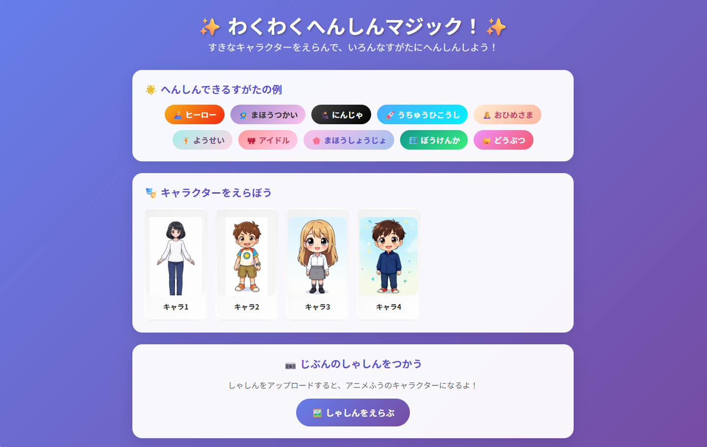
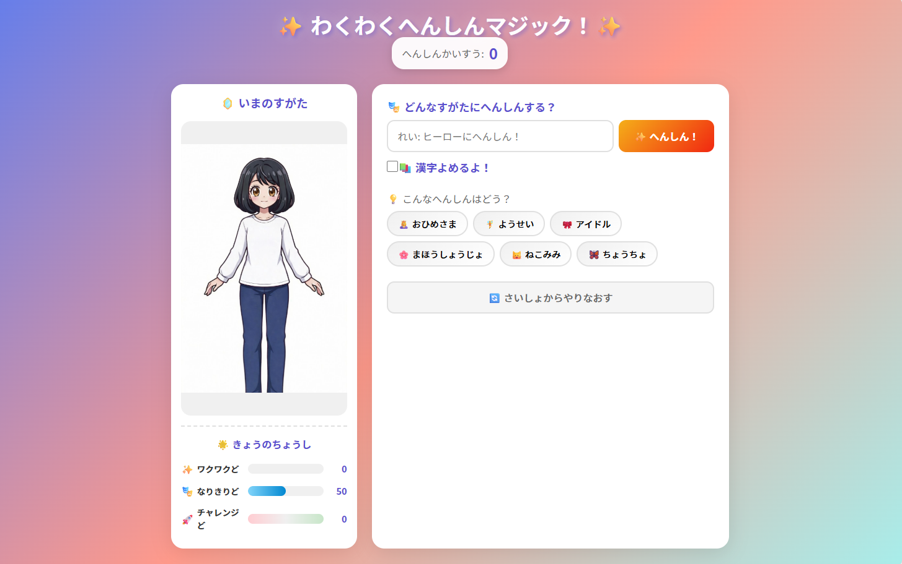
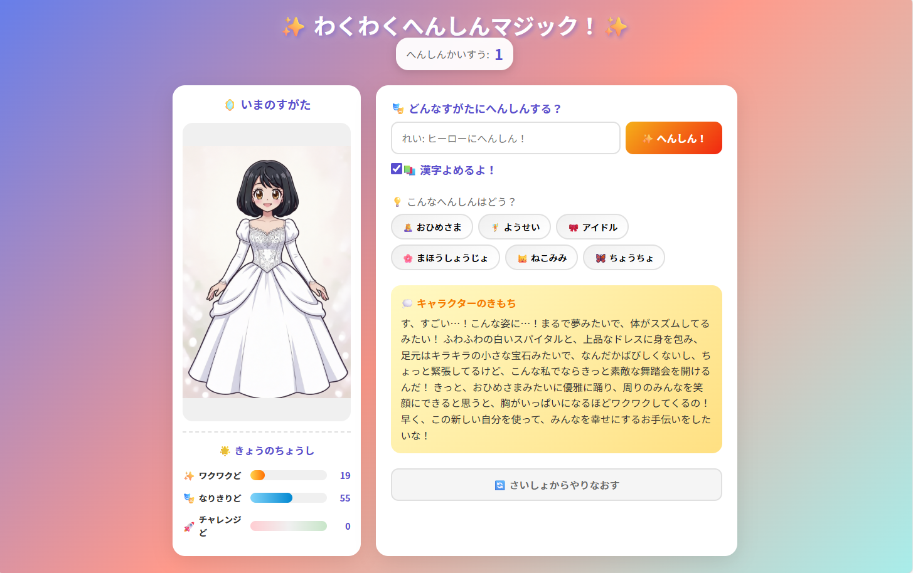
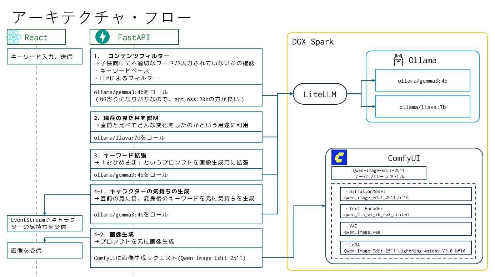

## わくわくへんしんマジック 🎮

AIを使った「変身ごっこ」遊びのデモアプリです。
イラストや写真をアニメ風に変換して、ヒーローやプリンセスに変身させます。

- 📸 写真をアップロードするとアニメ風に変換
- 🗣️ 「ヒーローになりたい！」など話しかけて変身
- 💬 変身したキャラクターがお話ししてくれる
- 利用想定：主に私（nata-water）の姪っ子（4歳）

### キャラクター選択



### 変身画面1



### 変身画面2



## 機能概要

1. **キャラクター選択**: プリセットキャラクターまたはカスタム画像を選択
2. **変身実行**: 「ヒーローになりたい！」などの変身指示
3. **画像生成**: AIが変身させた画像を生成
4. **気持ちの生成**: 変身した気持ちをセリフとして生成
5. **パラメータ変動**: ワクワク度・なりきり度・チャレンジ度が変化
6. **心理ステージ**: ドキドキ→ワクワク→なりきり→ヒーローフェーズへ進化
7. **エンディング**: 4種類のエンディングに分岐

## パラメータシステム

| パラメータ   | 範囲     | 説明                   |
| ------------ | -------- | ---------------------- |
| ワクワク度   | 0〜100   | 変身への期待と楽しさ   |
| なりきり度   | 0〜100   | キャラクターへの没入度 |
| チャレンジ度 | -50〜+50 | 新しい変身への積極性   |

## エンディング

| エンディング               | 条件                       |
| -------------------------- | -------------------------- |
| スーパーヒーローエンド     | ヒーロー系変身が最多       |
| マスターまほうつかいエンド | 魔法使い系変身が最多       |
| だいぼうけんかエンド       | 多様なスタイルにチャレンジ |
| へんしんマスターエンド     | 変身タイプが均等に分散     |

## クイックスタート

### 1. OllamaとLiteLLMのセットアップ

1. Ollamaで必要なモデルをpullします：
   ```bash
   ollama pull gemma3:4b
   ollama pull llava:7b
   ```
2. LiteLLM Proxyをセットアップし、画面からモデルを登録します
   - 詳細な手順：[DGX Sparkを試す機会を頂いたので試した - LiteLLMのセクションを参照](https://note.com/nata_water/n/n09d34fad1015)

### 2. 環境変数の設定

`.env.example` をコピーして `.env` を作成し、`YOUR_HOST` を実際のホストに変更してください：

```bash
cp .env.example .env
```

**YOUR_HOST の設定値：**

- LiteLLM および ComfyUI がインストールされたPCのIPアドレスまたはホスト名を指定
- **推奨環境**: NVIDIA DGX Spark（安定動作）
- **動作確認済み**: NVIDIA GeForce RTX 3070（画像生成に2分以上かかる場合があります）

### 3. 利用モデルと役割

| モデル             | 役割                 | 用途                             |
| ------------------ | -------------------- | -------------------------------- |
| `ollama/gemma3:4b` | コンテンツフィルター | 入力テキストの安全性チェック     |
| `ollama/gemma3:4b` | 心理状態生成         | キャラクターの気持ち・セリフ生成 |
| `ollama/llava:7b`  | 画像説明             | 画像からの特徴抽出（Vision LLM） |
| ComfyUI (Qwen)     | 画像生成             | 変身後のキャラクター画像生成     |

### 4. アプリケーション起動

```powershell
# 1. フロントエンドビルド
cd frontend
npm install
npm run dev

# 2. ゲームサーバーを起動
cd ../backend
uv run python launcher.py --port 8000

# 3. ブラウザでアクセス
# http://localhost:3000/
```

### 5. OpenRouterを利用する場合

ローカルGPU環境がない場合、OpenRouter APIを利用できます。

1. `.env` に OpenRouter API キーを設定：

   ```
   OPENROUTER_API_KEY=your_api_key_here
   ```

2. 各プロバイダーを `openrouter` に変更：

   ```bash
   # コンテンツフィルター
   CONTENT_FILTER_PROVIDER=openrouter
   CONTENT_FILTER_MODEL=google/gemini-3-flash-preview

   # 画像生成
   IMAGE_PROVIDER=openrouter
   OPENROUTER_IMAGE_MODEL=google/gemini-3-flash-preview

   # 画像説明
   IMAGE_DESCRIPTION_PROVIDER=openrouter
   OPENROUTER_VISION_MODEL=google/gemini-3-flash-preview

   # 心理状態
   FEELING_PROVIDER=openrouter
   OPENROUTER_LLM_MODEL=google/gemini-3-flash-preview
   ```

## アーキテクチャ及びフロー



## Docker

- 各モデルをダウンロードするため、SSD/HDDに関して、100GB程度のディスク空き容量があることを確認してください。
- おそらくメモリは64GB以上必要になります
- **ComfyUIのコンテナ起動完了後、モデルのダウンロード完了までに、1時間以上かかる**場合があります。
  - `docker compose logs -f comfyui`で状況を確認することをお勧めします。
- ComfyUI起動後、初回画像生成実行時はモデル読み込みのため、結構な時間がかかります

```shell
docker compose up -d
docker compose logs -f comfyui
```

- 参考
  - comfyuiで指定しているオプション: `--fast fp16_accumulation`

### ダウンロードされるモデル一覧

#### Ollama モデル

| モデル        | 用途                                       |
| ------------- | ------------------------------------------ |
| `gemma3:4b`   | コンテンツフィルター、心理状態・セリフ生成 |
| `llava:7b`    | 画像説明（Vision LLM）                     |
| `gpt-oss:20b` | 汎用LLM（予備）                            |

#### ComfyUI モデル（Qwen Image Edit）

| ファイル名                                                    | 種類            | 用途                                 |
| ------------------------------------------------------------- | --------------- | ------------------------------------ |
| `qwen_image_edit_2511_bf16.safetensors`                       | Diffusion Model | 画像編集・変身処理のメインモデル     |
| `qwen_2.5_vl_7b_fp8_scaled.safetensors`                       | Text Encoder    | テキストプロンプトの理解・エンコード |
| `qwen_image_vae.safetensors`                                  | VAE             | 画像のエンコード/デコード処理        |
| `Qwen-Image-Edit-2511-Lightning-4steps-V1.0-bf16.safetensors` | LoRA            | 高速推論用（4ステップで生成）        |

## ライセンス

- このアプリはMITライセンスの下で提供されています。

## 実装について

_このドキュメントは生成AIアシストによってメンテナンスされています_
