🌐 **日本語** | **[English](README_en.md)**

[](License.txt)

<p align="center">
  
</p>

# TSF Closet

> **TSF Closet** は [nata-water/wakuwaku-transform-magic](https://github.com/nata-water/wakuwaku-transform-magic) を fork し、TSF (性転換) テーマに特化させたインタラクティブ着せ替えゲームです。

キャラクター画像に対して自然言語で衣装変更を指示すると、AI が画像を変換し、キャラクターの心理変化をリアルタイムに描写します。パラメータの変動、臨界点イベントなど、ビジュアルノベル風のゲームシステムを搭載しています。

---

この README は `develop` ブランチの実装を対象としています。配布版は [Releases](https://github.com/grind-hash/tsf_closet/releases) の各バージョンを確認してください。

## スクリーンショット

### ゲームプレイ

|                       初期画面                        |                          着せ替え後                           |
| :---------------------------------------------------: | :-----------------------------------------------------------: |
| 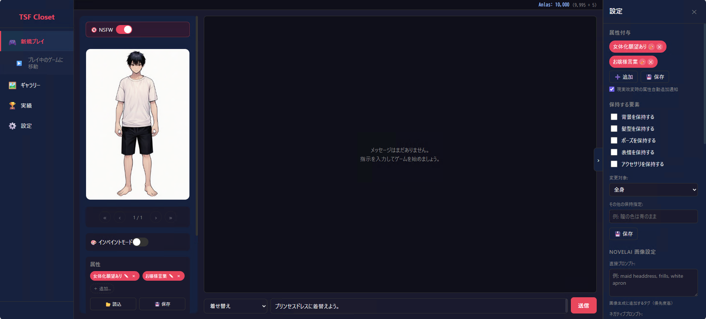 | 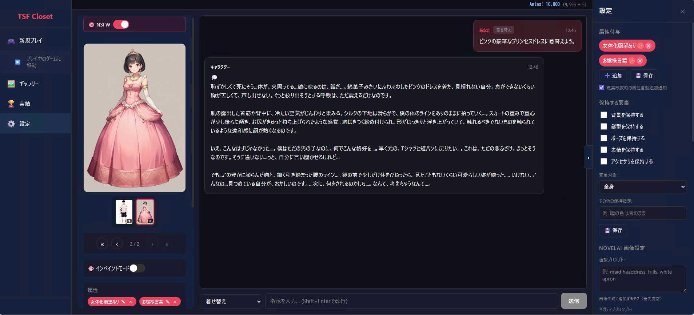 |

### プレイ要約 & 称号

|                  称号生成前                  |                  称号生成後                  |                      共有用プレビュー                      |
| :------------------------------------------: | :------------------------------------------: | :--------------------------------------------------------: |
| 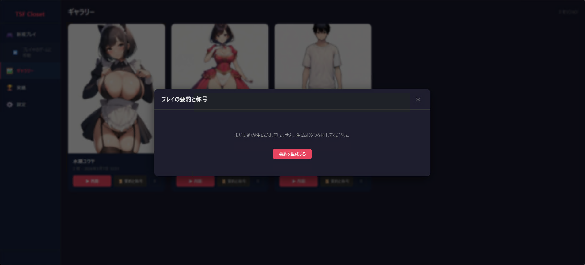 | 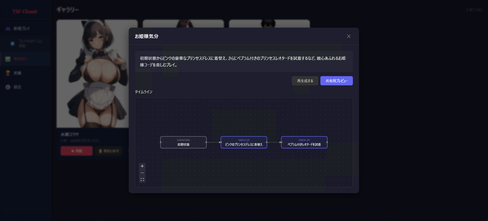 | 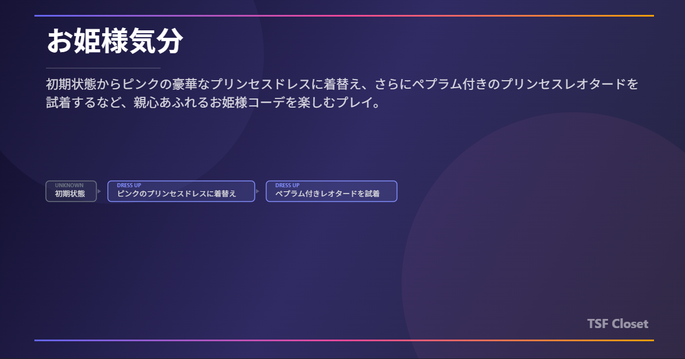 |

### インペイント (部分変更)

|                     マスク編集                     |                        生成中                        |                        結果                        |
| :------------------------------------------------: | :--------------------------------------------------: | :------------------------------------------------: |
| 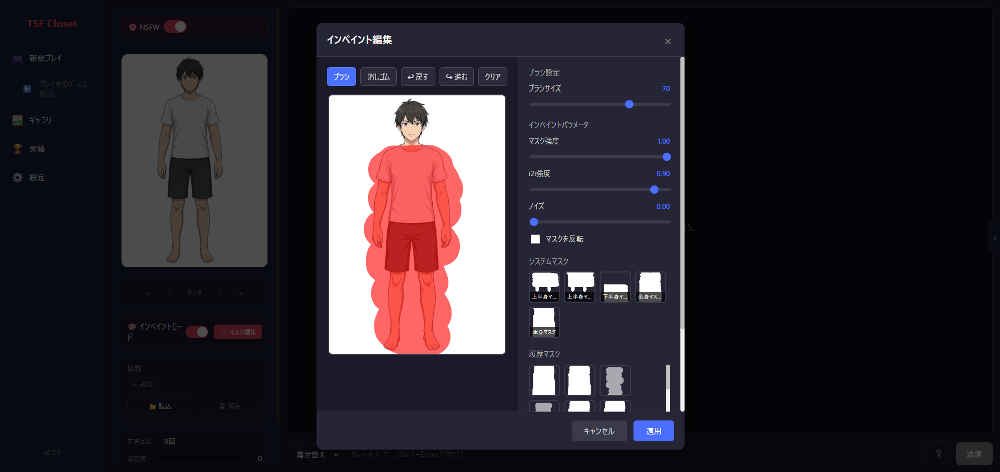 | 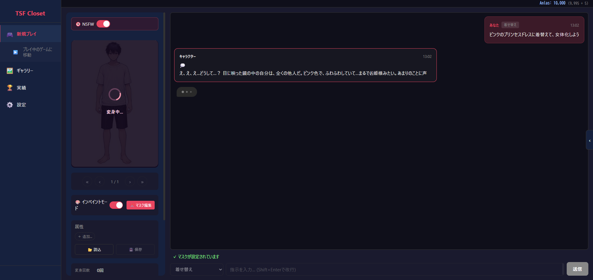 | 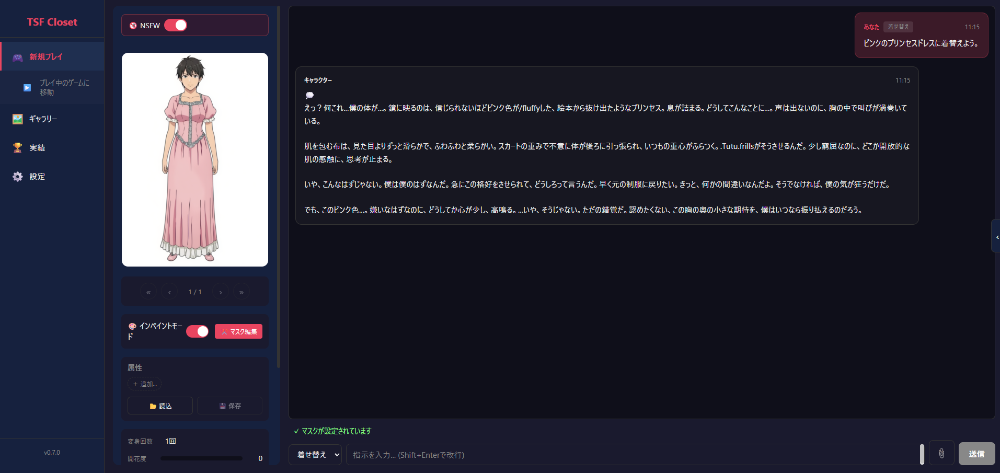 |

### ギャラリー

|                       セッション一覧                        |                       画像一覧                        |
| :---------------------------------------------------------: | :---------------------------------------------------: |
| 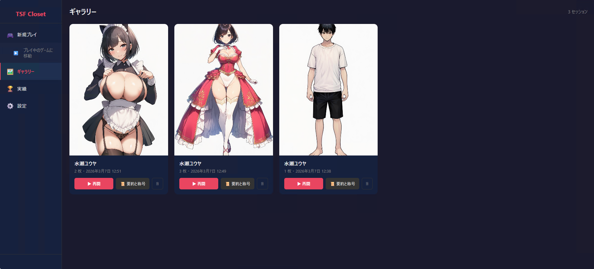 | 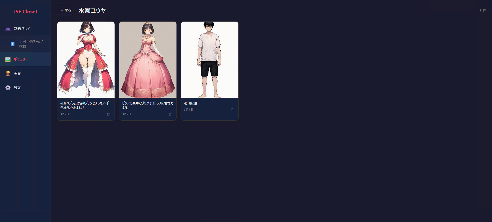 |

### 初回セットアップ (NovelAI)

|                     APIキー同意                     |                 サブスクリプション警告                 |
| :-------------------------------------------------: | :----------------------------------------------------: |
| 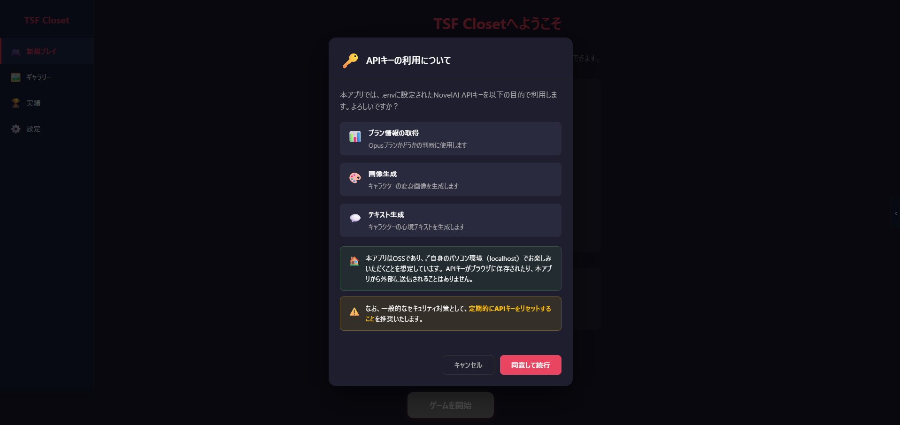 | 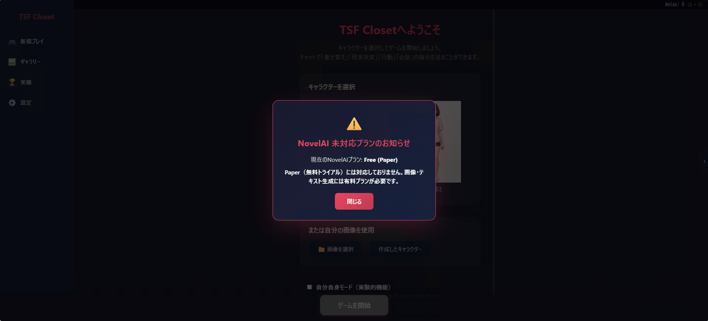 |

---

## 主な機能

| 機能                      | 説明                                                                                                                            |
| ------------------------- | ------------------------------------------------------------------------------------------------------------------------------- |
| **キャラクター選択**      | プリセットキャラクター or カスタム画像アップロード                                                                              |
| **着せ替え実行**          | 自然言語で衣装変更を指示 (例:「バニーレオタードに着替えて」)                                                                    |
| **AI 画像生成**           | ComfyUI / OpenRouter / NovelAI の 3 プロバイダーを切り替え可能                                                                  |
| **心境セリフ生成**        | Vision LLM + Text LLM でキャラクターの反応をストリーミング表示                                                                  |
| **パラメータシステム**    | 開花度・羞恥心・順応度が衣装に応じて変動                                                                                        |
| **臨界点イベント**        | 開花度が閾値に達すると特別な演出セリフが発火                                                                                    |
| **実績システム**          | 12 種類の実績を自動判定                                                                                                         |
| **ギャラリー**            | 過去の変身画像・達成エンディングを閲覧                                                                                          |
| **プレイ要約 & 称号**     | LLM がプレイ履歴から要約と称号 (二つ名) を自動生成                                                                              |
| **共有プレビュー**        | 要約カードを OGP 風画像 (1200×630) で保存・クリップボードコピー                                                                 |
| **インペイント / マスク** | 部分的な衣装変更に対応 (システム / 履歴 / プリセットマスク)                                                                     |
| **キャラクター会話**      | 通常プレイ中の会話に加え、独立した「キャラチャット」でセレナ・過去セッションの人物・シナリオの攻略対象と会話                    |
| **Live2D / VRM 表示**     | キャラチャットで 2D 立ち絵・VRM・セレナ専用 Live2D を選択。Live2D はドレス / プリンセス / バニーに対応（Core の別途配置が必要） |
| **自分自身モード**        | 自分のプロフィールを設定し、パラメータ追跡なしで着せ替え・行動・現実改変をプレイ                                                |
| **TSFシナリオ**           | 変身後の状態から始まるノベルゲーム。恋愛シミュレーション等 5 種のミッション                                                     |
| **対面会話モード**        | 攻略対象と 1 ターン = 1 往復で会話。3Dモデル (VRM) の表示と音声入力に対応 (実験的機能)                                          |
| **Prompt Expander**       | 自然文の指示を NovelAI 用プロンプトへ拡張し、ゲームと独立に画像を生成 (実験的機能)                                              |
| **音声合成**              | AivisSpeech によるセリフの読み上げ (実験的機能)                                                                                 |
| **NAI Diffusion V5 対応** | NSFW / 非 NSFW ごとのモデル選択と残り利用量の表示                                                                               |
| **メモリ**                | 好みメモリ (プレイ横断) とプレイメモ (プレイ内) を生成へ反映                                                                    |
| **お気に入り衣装**        | 履歴画像の☆登録・ラベル付け・一覧からの再開                                                                                     |
| **分岐 / 比較**           | 履歴画像から別セッションを開始、Before/After スライダーで変身を比較                                                             |
| **エクスポート**          | チャット履歴を Markdown / 小説形式 HTML の ZIP で保存                                                                           |
| **複数キャラクター**      | セッションを跨ぐ容姿の永続化とキャラクタープリセット (実験的機能)                                                               |
| **多言語対応**            | 日本語 / English 切り替え (会話言語バリデーション付き)                                                                          |

---

## アーキテクチャ

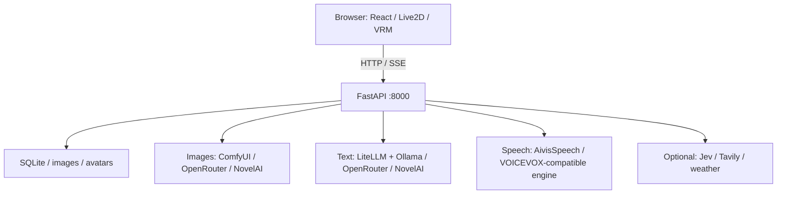
```mermaid
flowchart TD
    Browser["Browser: React / Live2D / VRM"] -->|HTTP / SSE| Backend["FastAPI :8000"]
    Backend --> Data["SQLite / images / avatars"]
    Backend --> Images["Images: ComfyUI / OpenRouter / NovelAI"]
    Backend --> Text["Text: LiteLLM + Ollama / OpenRouter / NovelAI"]
    Backend --> Speech["Speech: AivisSpeech / VOICEVOX-compatible engine"]
    Backend --> Optional["Optional: Jev / Tavily / weather"]
```

### 技術スタック

| レイヤー       | 技術                                               |
| -------------- | -------------------------------------------------- |
| フロントエンド | React 19 + TypeScript + Vite                       |
| バックエンド   | FastAPI + Python 3.12                              |
| データベース   | SQLite (aiosqlite + SQLAlchemy + Alembic)          |
| 画像生成       | ComfyUI (Qwen Image Edit) / OpenRouter / NovelAI   |
| テキスト生成   | LiteLLM Proxy → Ollama / OpenRouter / NovelAI Text |
| 国際化         | i18next (ja / en)                                  |
| コンテナ       | Docker Compose (7 サービス)                        |

---

## クイックスタート

### 配布版で遊ぶ

[Releases](https://github.com/grind-hash/tsf_closet/releases) から利用する OS・プロバイダーのパッケージを選び、展開します。NovelAI 版では `config.env` の `NOVELAI_API_KEY` を設定し、Windows は `start.bat`、Linux は `bash start.sh` で起動します。ブラウザで `http://127.0.0.1:8000/` を開いてください。詳細はパッケージ同梱の README を参照してください。

### ソースから起動する場合の前提条件

- Git、Python 3.12+、Node.js 24（開発・CI の基準）
- [uv](https://docs.astral.sh/uv/)（Python パッケージマネージャー）
- 画像・テキスト生成プロバイダーの準備：NovelAI API キー、OpenRouter API キー、または ComfyUI + LiteLLM / Ollama のセルフホスト環境
- 以下は Windows PowerShell の例です。NovelAI / OpenRouter 利用時は、画像生成用のローカル GPU は不要です。

### 1. リポジトリと環境変数の準備

```powershell
git clone --branch develop https://github.com/grind-hash/tsf_closet.git
cd tsf_closet

# NovelAI を使う場合。コピー後、.env の NOVELAI_API_KEY を設定
Copy-Item .env.example.novelai .env
```

OpenRouter は `.env.example.openrouter`、セルフホストは `.env.example.selfhost` をコピーしてください。既存の `.env` がある場合は上書きせず、必要な設定を追記・変更します。汎用の `.env.example` はセルフホストが既定です。`.env` はリポジトリルートに置きます。

### 2. 依存パッケージとデータベースの準備

```powershell
# リポジトリルートから実行
cd backend
uv sync --frozen
New-Item -ItemType Directory -Force data | Out-Null
uv run alembic upgrade head
cd ../frontend
npm ci
cd ..
```

Linux では `Copy-Item` の代わりに `cp`、データディレクトリ作成には `mkdir -p data` を使います。

### 3. アプリケーション起動

それぞれ別のターミナルをリポジトリルートで開きます。

```powershell
# ターミナル1: バックエンド（ポート8000）
cd backend
uv run uvicorn gateway.app:app --host 0.0.0.0 --port 8000 --reload
```

```powershell
# ターミナル2: フロントエンド（ポート3000）
cd frontend
npm run dev
```

ブラウザで `http://localhost:3000/` を開きます。API 仕様は `http://localhost:8000/docs`、稼働確認は `http://localhost:8000/health` で確認できます。

---

## Docker デプロイ

同梱の `compose.yaml` は GPU を使うセルフホスト構成です。リポジトリルートの `.env`（Compose / LiteLLM 用）と `.env.docker`（バックエンド用）を確認してから起動します。バックエンド設定は `.env.docker` が読み込まれるため、クラウド API キーなどを使う場合もこちらに設定します。起動後は `http://localhost/` を開きます。

```powershell
docker compose up -d
# バックエンドのデータベースマイグレーション適用
docker compose exec backend uv run alembic upgrade head
```

> **注意**: ComfyUI のモデルダウンロード完了まで 1 時間以上かかる場合があります。`docker compose logs -f comfyui` で進行状況を確認してください。

| サービス     | 説明                     | ポート |
| ------------ | ------------------------ | ------ |
| `frontend`   | React + nginx            | 80     |
| `backend`    | FastAPI                  | 8000   |
| `litellm`    | LiteLLM Proxy            | 4000   |
| `litellm_db` | PostgreSQL 16            | 5432   |
| `ollama`     | ローカル LLM (GPU)       | —      |
| `comfyui`    | 画像生成 (GPU)           | 8188   |
| `aivis`      | AivisSpeech Engine (GPU) | 10101  |

**システム要件** (Docker):

- NVIDIA GPU (ollama, comfyui, aivis)
- ストレージ: 100 GB 以上の空き容量
- メモリ: 64 GB 以上推奨

---

## ポータブル版ビルド

Windows / Linux 向けのポータブル配布パッケージを作成できます。以下はリポジトリルートから実行します。

### Windows

```powershell
.\scripts\build_portable.ps1 -Version "dev" -Provider novelai
```

| パラメータ      | 説明                                  | デフォルト |
| --------------- | ------------------------------------- | ---------- |
| `-Version`      | バージョン文字列                      | `dev`      |
| `-Provider`     | `novelai` / `selfhost` / `openrouter` | `novelai`  |
| `-Force`        | 既存出力を上書き                      | —          |
| `-NoZip`        | ZIP 作成をスキップ                    | —          |
| `-SkipFrontend` | フロントエンドビルドをスキップ        | —          |
| `-SkipPython`   | Python 環境構築をスキップ             | —          |

出力先: `dist/tsf_closet_portable_v{Version}_{Provider}/`

### Linux

```bash
bash scripts/build_portable_linux.sh --version dev --provider novelai
```

`--provider` は `novelai` / `selfhost` / `openrouter` を指定できます。`--force`、`--no-archive`、`--skip-frontend`、`--skip-python` にも対応します。ビルドには Node.js / npm、curl、tar、bc などが必要です。

出力先: `dist/tsf_closet_portable_v{Version}_{Provider}_linux/`（アーカイブは `.tar.gz`）。

両 OS とも Python とビルド済みフロントエンドを同梱します。生成 API、セルフホスト用サーバー、音声合成エンジンは別途必要です。

---

## 画像生成プロバイダー

環境変数 `IMAGE_PROVIDER` で切り替え:

| プロバイダー | 環境変数例                               | 必要なもの                   |
| ------------ | ---------------------------------------- | ---------------------------- |
| `selfhost`   | `COMFYUI_BASE_URL=http://127.0.0.1:8188` | NVIDIA GPU + ComfyUI         |
| `openrouter` | `OPENROUTER_API_KEY=sk-...`              | OpenRouter API キー          |
| `novelai`    | `NOVELAI_API_KEY=pst-...`                | NovelAI API キー (Opus 推奨) |

テキスト生成 (心境セリフ) も同様に `FEELING_PROVIDER` で切り替え可能です。

> **OpenRouter 利用時の注意**
>
> - R18 / NSFW モードの画像生成・画像編集には**対応していません** (対応モデルが現時点で見つかっていないため)。
> - 内部で nano banana を利用しているため、「バニーガール」など一部のプロンプトがコンテンツフィルターに抵触し、画像生成エラーになる場合があります。

> **NAI Diffusion V5**
>
> - NSFW / 非 NSFW それぞれで使用する画像生成モデル (V4.5 Full / V5 Full / V4.5 Curated / V5 Curated) を設定画面から選択できます。
> - V5 の残り利用量を表示します (上限到達後の生成は Anlas を消費します)。
> - 精密参照は V4.5 モデル選択時のみ利用可能です。

---

## ゲームシステム

### パラメータ

| パラメータ          | 範囲       | 説明                                           |
| ------------------- | ---------- | ---------------------------------------------- |
| 開花度 (bloom)      | 0 〜 100   | 女性化への順応度。衣装の露出度・カテゴリで増加 |
| 羞恥心 (shame)      | 0 〜 100   | 露出度の高い衣装で上昇。開花速度に影響         |
| 順応度 (adaptation) | -50 〜 +50 | 正は積極的、負は抵抗的な心理状態               |

### 難易度

| 難易度              | 羞恥心初期値 | 開花倍率 | 順応倍率 |
| ------------------- | ------------ | -------- | -------- |
| easy (抵抗しやすい) | 70           | 0.5x     | 1.0x     |
| normal (普通)       | 50           | 1.0x     | 1.0x     |
| hard (堕ちやすい)   | 30           | 1.5x     | 1.2x     |

### 臨界点イベント

開花度が閾値に達すると、キャラクターが特別な演出セリフを発します:

| 閾値 | 内容                             |
| ---- | -------------------------------- |
| 25%  | 女性化への違和感を自覚           |
| 50%  | 抵抗と快楽の狭間で揺れる         |
| 75%  | 女性としての感覚を受け入れ始める |
| 100% | 完全に女性として順応             |

### エンディング (4 種類)

| エンディング       | 条件概要                        |
| ------------------ | ------------------------------- |
| 快楽開花エンド     | 開花度 100 + 露出系変身が最多   |
| 自己受容エンド     | 開花度 100 + 可愛い系変身が最多 |
| 抵抗の限界エンド   | 変身 15 回 + 開花度 50 未満     |
| 好奇心の暴走エンド | 開花度 100 + タグ分散           |

### 実績システム (12 種類)

変身回数、女装回数、コレクション数、開花度などの条件に応じて自動的にアンロックされます。

---

## TSFシナリオ (アドベンチャーモード)

変身後の状態 (セッションの任意の時点) を起点に、独立したノベルゲーム形式のシナリオをプレイできます。メインメニューの「TSFシナリオ」から開けます (設定画面の「TSFシナリオ」で非表示にもできます)。

- **ミッション**: 「恋愛シミュレーション」「潜入」「脱出・帰還」「交渉」「なりすまし・着替え」の 5 種類。舞台・ゴール・制約は AI による自動生成のほか、直接入力や用意された作品シナリオ (「女装してプリンセスにならないと出られない部屋」) からの選択に対応
- **恋愛シミュレーション**: 日数制 (昼・夜) の進行、好感度、所持金、バイト、ギフトショップ、告白、エンディング後のエピローグ。主人公には別セッションや Prompt Expander の画像を使用でき、攻略対象が主人公を呼ぶ「呼び名」も指定可能
- **現実改変**: 「現実改変：〜」で世界ルールを宣言し、以降のすべての判定に適用 (手番を消費しない属性付与も可能)
- **トーク**: 手番を消費しない雑談。好感度・所持金・日数は変わらず、会話の内容は次の手番の物語に引き継がれる
- **BGM 自動選曲**: 場面に合わせて BGM を自動選曲 (楽曲は Suno AI 製)。BGM テスト画面で試聴可能
- **語りと口調**: 語りの人称 (一人称 / 二人称 / 三人称) と、主人公・攻略対象の口調を指定可能
- **その他**: 手番の巻き戻し、場面画像のプロンプト編集・再生成、ログ表示、Anlas 消費の見積もり表示に対応
- NovelAI に加えて OpenRouter / セルフホスト (ComfyUI) でもプレイ可能 (プロバイダーにより一部機能が制限されます)

処理フローの詳細は [docs/adventure-flow.md](docs/adventure-flow.md) を参照してください。

<!-- TODO: screenshot repo_resources/screen08_adventure_title.png (ミッション選択) / repo_resources/screen09_adventure_sim.png (恋愛シミュレーションの HUD) -->

### 対面会話モード

恋愛シミュレーションで有効化できるモードです (既定 OFF)。攻略対象が目の前に立ち、1 ターン = 1 往復の会話になります。昼・夜の区切りは無く、設定したターン数の往復で結果が確定します。

- 画像は攻略対象の立ち絵と背景 (場所が変わったときだけ) のみを生成します。セルフホスト (ComfyUI) では背景を txt2img 用ワークフロー (`COMFYUI_TXT2IMG_WORKFLOW_PATH`) で生成します
- セリフ読み上げに対応。本文の「名前「セリフ」」行だけを AivisSpeech で自動再生し、再生中は BGM の音量を下げます
- マイクによる音声入力に対応 (Chrome / Edge)。ブラウザの音声認識を使うため、Chrome では音声が Google のサーバーへ送られます

<!-- TODO: screenshot repo_resources/screen10_adventure_companion.png (対面会話モード + 3Dモデル) -->

---

## キャラチャット / Live2D

設定の「Experimental（実験的機能）」で「キャラチャット」を有効にすると、メニューから `/talk` を開けます。

- **案内役セレナ**: 好みメモリや過去のプレイを踏まえて会話し、おすすめのプレイを提案します。
- **過去セッションの人物**: 履歴の画像・心境・経緯を引き継いで会話を開始できます。TSFシナリオの攻略対象との会話にも対応します。
- **姿と音声**: 2D 立ち絵、登録済み VRM、セレナ専用 Live2D を選択でき、AivisSpeech で返答を読み上げます。Live2D はドレス / プリンセス / バニーの切り替え、全身 / 寄り表示、表情・まばたき・口の動きに対応します。
- **調べ物**: セレナの Web 検索は `TAVILY_API_KEY` と設定画面での有効化が必要です。天気の都市は `WEATHER_LOCATION` で設定します。

Live2D Cubism Core はリポジトリに含まれません。[配置手順](frontend/public/live2d/vendor/README.md) に従い、`live2dcubismcore.min.js` をソース版では `frontend/public/live2d/vendor/`、配布版では `backend/static/live2d/vendor/` に配置してください。配置しなくても 2D 立ち絵で利用できます。Live2D Core・モデルの利用条件はそれぞれの配布元を確認してください。

---

## 3Dモデル (VRM) アバター

対面会話モードで、攻略対象の立ち絵の代わりに 3D モデル (VRM 0.x / 1.0) を表示できます。設定画面の「3Dモデル (VRM)」からドラッグ＆ドロップで登録します。

- 読み上げの音素タイミングに合わせて口が動き、返答ごとに表情と身振りが変わります
- ファイル名が「キャラクター名_衣装_髪型Ver.vrm」の形なら、キャラクターと衣装差分を自動で分類します。同じキャラクターの差分が 2 つ以上あると、着替えの場面に合わせてモデルが切り替わります
- 登録済みモデルのプレビューで、表情と身振りの見え方を確認できます
- FBX や PMX は VRM に変換してから登録してください。モデルの利用条件は各配布元の規約に従ってください

<!-- TODO: screenshot repo_resources/screen13_avatar_preview.png (3Dモデルプレビュー) -->

---

## Prompt Expander

自然文の指示を LLM で NovelAI 用プロンプトに拡張し、ゲームとは独立に画像を生成・保存できる実験的機能です。設定画面の「Experimental」から「Prompt Expander」を有効にすると、メインメニューに表示されます。

- 出力形式は「日本語文」「タグ」から選択。セッション単位で履歴を管理し、「欄へ復元」「このプロンプトで再生成」「i2i元にする」「通常プレイで使う」「TSFシナリオで使う」が行えます
- キャラクタープロンプトに対応 (V5 系は最大 22 件、V4.5 系は最大 6 件)。メモリから好みのキャラクター像を提案してスロットへ挿入できます
- 漫画 (コマ割り) モード (NAI Diffusion V5 系専用): コマ数・コマ割り・読み順 (既定は日本式の右→左)・セリフの言語を指定。あらすじから記法付きネームの下書きにも対応
- インペイント (部分修正)、精密参照 (V4.5 系専用、参照 1 枚あたり追加の Anlas を消費)、画像の背景透過、画面へのドラッグ＆ドロップに対応

<!-- TODO: screenshot repo_resources/screen11_prompt_expander.png (漫画モード) -->

---

## 音声合成 (AivisSpeech)

AivisSpeech エンジンによるセリフの読み上げに対応した実験的機能です。設定画面の「音声合成 (AivisSpeech)」から有効化します。

- 通常プレイのチャット読み上げ、TSFシナリオ (対面会話モード) のセリフ自動再生、キャラチャットの返答読み上げに対応
- VOICEVOX 互換エンジンへの接続にも対応
- 音声の初期音量は 50% で、音量と再生速度を調整できます

<!-- TODO: screenshot repo_resources/screen12_settings_tts.png (音声合成設定) -->

---

## メモリ (好みメモリ / プレイメモ)

- **好みメモリ**: 過去のプレイログを分析し、好みのシチュエーションを自動生成します。生成されたメモリは自由に編集でき、プレイを跨いで着せ替え・現実改変・行動などの指示、指示文の提案、画像生成に反映されます
- **プレイメモ (実験的機能)**: プレイごとの経緯を自動的に要約し、そのプレイ内の生成に反映します。維持したい設定や希望はユーザーメモとして手動設定できます。有効時はチャットごとに自動メモを生成するため、応答完了までの時間が長くなる場合があります

---

## API エンドポイント

主なエンドポイントを抜粋しています。リクエスト・レスポンスの最新スキーマは、起動後の `http://localhost:8000/docs` または `/openapi.json` を参照してください。表中の `/` はプレフィックス自体を示します（末尾スラッシュなし）。

### Game (`/api/game`)

| メソッド | パス            | 説明                              |
| -------- | --------------- | --------------------------------- |
| `POST`   | `/start`        | ゲームセッション開始              |
| `POST`   | `/start-custom` | カスタム画像でセッション開始      |
| `POST`   | `/play/stream`  | 着せ替え実行 (SSE ストリーミング) |
| `GET`    | `/characters`   | キャラクター一覧取得              |
| `GET`    | `/session`      | アクティブセッション取得          |
| `GET`    | `/sessions`     | セッション一覧 (ページネーション) |
| `DELETE` | `/session`      | セッションリセット                |
| `POST`   | `/chat`         | キャラクターとの会話              |
| `GET`    | `/endings`      | エンディング一覧                  |
| `GET`    | `/masks`        | マスク一覧取得                    |

### Gallery (`/api/gallery`)

| メソッド | パス                             | 説明                                  |
| -------- | -------------------------------- | ------------------------------------- |
| `GET`    | `/`                              | ギャラリーアイテム一覧                |
| `GET`    | `/sessions`                      | セッション別ギャラリー                |
| `GET`    | `/{item_id}`                     | アイテム詳細 (前後ナビ付き)           |
| `DELETE` | `/{item_id}`                     | アイテム削除                          |
| `GET`    | `/sessions/{session_id}/summary` | プレイ要約・称号の取得                |
| `POST`   | `/sessions/{session_id}/summary` | プレイ要約・称号の生成 (`?language=`) |

### Achievements (`/api/achievements`)

| メソッド | パス                | 説明         |
| -------- | ------------------- | ------------ |
| `GET`    | `/`                 | 実績一覧取得 |
| `GET`    | `/{achievement_id}` | 実績詳細取得 |

### Settings (`/api/settings`)

| メソッド | パス    | 説明               |
| -------- | ------- | ------------------ |
| `GET`    | `/`     | セッション設定取得 |
| `PUT`    | `/`     | セッション設定更新 |
| `GET`    | `/user` | ユーザー設定取得   |
| `PUT`    | `/user` | ユーザー設定更新   |

### その他のルーター (概要)

| プレフィックス         | 説明                                                                                 |
| ---------------------- | ------------------------------------------------------------------------------------ |
| `/api/adventure`       | TSFシナリオ (Run / テンプレート / 手番 SSE / トーク SSE / 現実改変 / 巻き戻し / BGM) |
| `/api/prompt-expander` | Prompt Expander (セッション / エントリ / 拡張 / 生成 / 漫画ネーム / 設定)            |
| `/api/character-chat`  | キャラチャットのスレッド作成・削除、会話 SSE、姿・モデル切り替え、立ち絵生成         |
| `/api/avatars`         | 3Dモデル (VRM) の登録・自動分類・配信                                                |
| `/api/aivisspeech`     | 音声合成 (`/synthesize`、viseme タイムライン付き `/synthesize-timed`、エンジン管理)  |
| `/api/memory`          | 好みメモリの生成ジョブ・本文編集                                                     |
| `/api/favorites`       | お気に入り衣装の一覧・登録・ラベル変更                                               |
| `/api/game` (複数人物) | セッション人物の管理とキャラクタープリセット                                         |

### SSE イベント (`/api/game/play/stream`)

| イベント      | データ                                  |
| ------------- | --------------------------------------- |
| `text`        | キャラクターの心境セリフ (チャンク形式) |
| `image`       | 生成画像の Base64 データ                |
| `tags`        | 衣装タグ情報 (カテゴリ・露出度)         |
| `stats`       | パラメータ変動値                        |
| `critical`    | 臨界点到達時の演出セリフ                |
| `ending`      | エンディング判定結果                    |
| `achievement` | 実績アンロック通知                      |
| `complete`    | 処理完了                                |

料金 (`cost`)・Anlas 残量 (`anlas`)・処理エラー (`error`) などのイベントも送信します。

---

## 環境変数一覧

<details>
<summary>クリックで展開</summary>

### 共通

| 変数名                       | 説明                                                                               | デフォルト |
| ---------------------------- | ---------------------------------------------------------------------------------- | ---------- |
| `PORT`                       | サーバーポート                                                                     | `8000`     |
| `LOG_LEVEL`                  | ログレベル                                                                         | `info`     |
| `IMAGE_PROVIDER`             | 画像生成プロバイダー (`selfhost` / `openrouter` / `novelai`)                       | `selfhost` |
| `IMAGE_DESCRIPTION_PROVIDER` | 画像説明プロバイダー                                                               | `selfhost` |
| `FEELING_PROVIDER`           | 心境生成プロバイダー                                                               | `selfhost` |
| `ENABLE_PROMPT_PREVIEW`      | TSFシナリオのプロンプト確認機能                                                    | `false`    |
| `TAVILY_API_KEY`             | キャラチャットのセレナが使う Web 検索 (Tavily) の API キー。設定画面のトグルと併用 | (なし)     |
| `WEATHER_LOCATION`           | キャラチャットのセレナが天気を調べる都市名 (例: `Tokyo`、Open-Meteo でキー不要)    | (なし)     |
| `JEV_PROVIDER`               | 構造化判定 (TypeSafe AI Jev) の経路 (`off` / `openrouter` / `typesafe`)            | `off`      |
| `JEV_LIVE_TARGETS`           | Jev の判定を実際の挙動へ反映する対象 (空ならログのみ)                              | (なし)     |
| `TYPESAFE_API_KEY`           | TypeSafe AI を直接利用する場合の API キー                                          | (なし)     |

### ComfyUI (selfhost)

| 変数名                          | デフォルト                                                                                                                                                       |
| ------------------------------- | ---------------------------------------------------------------------------------------------------------------------------------------------------------------- |
| `COMFYUI_BASE_URL`              | `http://127.0.0.1:8188`                                                                                                                                          |
| `COMFYUI_WORKFLOW_PATH`         | `workflows/qwen_image_edit_template.json`                                                                                                                        |
| `COMFYUI_TXT2IMG_WORKFLOW_PATH` | 未設定時は `COMFYUI_WORKFLOW_PATH` のファイル名の `image_edit` を `image_txt2img` に置き換えたもの (無ければ `workflows/qwen_image_txt2img_template_local.json`) |
| `COMFYUI_REQUEST_TIMEOUT`       | `180`                                                                                                                                                            |

### LiteLLM (selfhost)

| 変数名                  | デフォルト (.env.example)                     |
| ----------------------- | --------------------------------------------- |
| `LITELLM_BASE_URL`      | `http://127.0.0.1:4000`                       |
| `LITELLM_LLAVA_MODEL`   | `ollama/ministral-3:14b-instruct-2512-q4_K_M` |
| `LITELLM_LLM_MODEL`     | `ollama/ministral-3:14b-instruct-2512-q4_K_M` |
| `LITELLM_FEELING_MODEL` | `ollama/ministral-3:14b-instruct-2512-q4_K_M` |

セルフホスト構成 (`.env.example.selfhost`) では 3 つのモデルの既定値は `gemma4:e4b` です。

### OpenRouter

| 変数名                    | デフォルト (.env.example)       |
| ------------------------- | ------------------------------- |
| `OPENROUTER_API_KEY`      | (必須)                          |
| `OPENROUTER_IMAGE_MODEL`  | `google/gemini-2.5-flash-image` |
| `OPENROUTER_VISION_MODEL` | `google/gemini-3-flash-preview` |
| `OPENROUTER_LLM_MODEL`    | `google/gemini-3-flash-preview` |

### TypeSafe AI (Jev) — 実験的

テキストを生成しない判定専用モデル。性別適合判定・セレナの調べ物の必要性・変身タグ分類を、
汎用 LLM に JSON を書かせる代わりに型付きの質問として問い合わせます。
生成プロバイダーとは独立した軸なので、`IMAGE_PROVIDER` などの構成は変えずに足せます。

既定は `off` で、**API キーが設定されているだけでは使いません**。有効にすると選んだ経路
(`openrouter` なら `OPENROUTER_API_KEY`) に課金されます。設定例は `.env.example.jev` を参照してください。

| 変数名                         | デフォルト            |
| ------------------------------ | --------------------- |
| `JEV_PROVIDER`                 | `off`                 |
| `JEV_MODEL`                    | (経路ごとの既定)      |
| `JEV_TIMEOUT`                  | `10`                  |
| `JEV_LIVE_TARGETS`             | (空 = すべてシャドー) |
| `JEV_HIGH` / `JEV_LOW`         | `0.7` / `0.3`         |
| `JEV_MIN_CONFIDENCE`           | `0.5`                 |
| `JEV_INPUT_PRICE_USD_PER_MTOK` | `0.042`               |

`JEV_LIVE_TARGETS` が空のあいだは、既存の判定と並べて走らせた結果をログに出すだけで挙動は変わりません
(`jev_shadow` で始まる行)。一致率を確かめてから `congruence` / `chat_lookup` / `search_policy` / `tags`
を 1 つずつ足してください。

### NovelAI

| 変数名                          | デフォルト                             |
| ------------------------------- | -------------------------------------- |
| `NOVELAI_API_KEY`               | (必須)                                 |
| `NOVELAI_MODEL`                 | `nai-diffusion-4-5-full`               |
| `NOVELAI_INPAINT_MODEL`         | `nai-diffusion-4-5-full-inpainting`    |
| `NOVELAI_CURATED_MODEL`         | `nai-diffusion-4-5-curated`            |
| `NOVELAI_CURATED_INPAINT_MODEL` | `nai-diffusion-4-5-curated-inpainting` |
| `NOVELAI_STEPS`                 | `28`                                   |
| `NOVELAI_SCALE`                 | `5.0`                                  |
| `NOVELAI_I2I_STRENGTH`          | `0.9`                                  |
| `NOVELAI_TEXT_MODEL`            | `glm-4-6`                              |

### データ永続化

| 変数名               | デフォルト             |
| -------------------- | ---------------------- |
| `DATABASE_PATH`      | `data/database.sqlite` |
| `HISTORY_IMAGES_DIR` | `data/history_images`  |
| `HISTORY_MAX_COUNT`  | `50`                   |
| `CHARACTERS_DIR`     | `images/characters`    |

</details>

---

## キャラクターの追加

[backend/images/characters/characters.json](backend/images/characters/characters.json) を編集し、同ディレクトリに画像を配置します:

```json
{
  "characters": [
    {
      "id": "char1",
      "name": "主人公",
      "description": "普通の男子高校生",
      "image_path": "char1.png",
      "pronoun": "僕",
      "personality": "内気で真面目"
    }
  ]
}
```

カスタム画像はゲーム開始時に UI からアップロードすることも可能です。

---

## フロントエンド画面

| パス                      | 画面                                 |
| ------------------------- | ------------------------------------ |
| `/` `/play`               | メインゲーム画面                     |
| `/gallery`                | ギャラリー                           |
| `/achievements`           | 実績一覧                             |
| `/endings`                | エンディング一覧                     |
| `/adventure`              | TSFシナリオ (設定で非表示にできる)   |
| `/bgm-test`               | BGM テスト (TSFシナリオ有効時)       |
| `/prompt-expander`        | Prompt Expander (実験的機能で有効化) |
| `/talk` `/talk/:threadId` | キャラチャット（実験的機能で有効化） |
| `/guide`                  | 使い方ガイド                         |
| `/settings`               | 設定                                 |

---

## 開発

作業前に [AGENTS.md](AGENTS.md) と [Constitution](.specify/memory/constitution.md) を確認してください。起動手順はクイックスタートを参照してください。

各コードブロックはリポジトリルートから実行します。検証は変更対象に絞ってください。

```powershell
# フロントエンド
cd frontend
npm run lint
npm run build
npm run test
# E2E を実行する場合はブラウザを事前に導入
npx playwright install chromium
npm run e2e:test
```

```powershell
# バックエンド
cd backend
uv run ruff check .
uv run pytest
```

```powershell
# README の整形確認（Markdown は Prettier）
cd frontend
npx prettier --check ../README.md ../README_en.md
```

### マイグレーション

```powershell
cd backend
uv run alembic revision --autogenerate -m "migration_comment"
uv run alembic upgrade head
```

### データの保存とバックアップ

通常は `backend/data/` に SQLite、生成画像、登録済みモデルなどが保存されます。アプリを停止してからフォルダ全体をバックアップしてください。保存先を環境変数で変更した場合は、その保存先も対象です。Docker では `tsf_closet_backend_data` ボリュームに保存されます。

---

## fork 元との差分

本プロジェクトは nata-waterさんが開発された[wakuwaku-transform-magic](https://github.com/nata-water/wakuwaku-transform-magic) (子供向け変身ごっこアプリ) を fork し、以下の変更を加えています:

- TSF (性転換) テーマへの全面的な書き換え
- パラメータシステムの再設計 (ワクワク度 → 開花度 / 羞恥心 / 順応度)
- エンディング条件の再設計
- NovelAI プロバイダーの追加 (NAI Diffusion V5 対応を含む)
- インペイント / マスク機能の追加
- 実績システムの追加
- ギャラリー機能の拡張 (お気に入り衣装、変身の比較、キーワード検索、履歴分岐)
- 会話 (チャット) 機能と独立したキャラチャット / Live2D 表示の追加
- 多言語対応 (i18next)
- Windows / Linux ポータブル版ビルドスクリプト
- 画質改善機能
- TSFシナリオ (アドベンチャーモード) の追加
- 対面会話モードと 3Dモデル (VRM) アバターの追加
- Prompt Expander の追加
- 音声合成 (AivisSpeech) の追加
- 好みメモリ / プレイメモの追加
- 複数キャラクターの永続化とキャラクタープリセットの追加

---

## ライセンス

[MIT License](License.txt) - Copyright (c) 2026 nata-water
