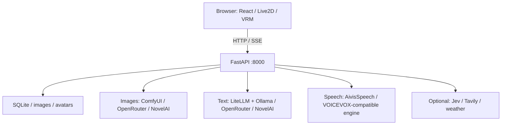

🌐 **[日本語](README.md)** | **English**

[](License.txt)

<p align="center">
  
</p>

# TSF Closet

> **TSF Closet** is an interactive dress-up game forked from [nata-water/wakuwaku-transform-magic](https://github.com/nata-water/wakuwaku-transform-magic), specialized for the TSF (gender transformation) theme.

Give natural-language instructions to change character outfits and watch AI transform the image while depicting the character's psychological changes in real-time. The game features parameter fluctuations, critical-point events, and a visual-novel-style game system.

---

This README describes the implementation on `develop`. For packaged versions, see [Releases](https://github.com/grind-hash/tsf_closet/releases).

## Screenshots

### Gameplay

|                    Initial Screen                     |                      After Dress-Up                       |
| :---------------------------------------------------: | :-------------------------------------------------------: |
|  |  |

### Play Summary & Title

|                  Before Generation                  |                  After Generation                  |                     Share Preview                      |
| :-------------------------------------------------: | :------------------------------------------------: | :----------------------------------------------------: |
|  |  |  |

### Inpaint (Partial Changes)

|                   Mask Editing                    |                      Generating                      |                      Result                      |
| :-----------------------------------------------: | :--------------------------------------------------: | :----------------------------------------------: |
|  |  |  |

### Gallery

|                      Session List                      |                      Image List                      |
| :----------------------------------------------------: | :--------------------------------------------------: |
|  |  |

### First-Time Setup (NovelAI)

|                    API Key Consent                    |                 Subscription Warning                 |
| :---------------------------------------------------: | :--------------------------------------------------: |
|  |  |

---

## Key Features

| Feature                   | Description                                                                                                                                         |
| ------------------------- | --------------------------------------------------------------------------------------------------------------------------------------------------- |
| **Character Selection**   | Preset characters or custom image upload                                                                                                            |
| **Dress-Up Execution**    | Natural language outfit instructions (e.g. "Change into a bunny suit")                                                                              |
| **AI Image Generation**   | Switch between ComfyUI / OpenRouter / NovelAI providers                                                                                             |
| **Mood Text Generation**  | Vision LLM + Text LLM stream character reactions in real-time                                                                                       |
| **Parameter System**      | Bloom, Shame, and Adaptation fluctuate based on outfits                                                                                             |
| **Critical-Point Events** | Special dialogue triggers when Bloom reaches thresholds                                                                                             |
| **Achievement System**    | 12 achievements auto-detected                                                                                                                       |
| **Gallery**               | Browse past transformation images and completed endings                                                                                             |
| **Play Summary & Title**  | LLM auto-generates a summary and title (epithet) from play history                                                                                  |
| **Share Preview**         | Save summary card as OGP-style image (1200×630) or copy to clipboard                                                                                |
| **Inpaint / Masks**       | Partial outfit changes (system / history / preset masks)                                                                                            |
| **Character Chat**        | In-game chat plus a separate chat screen for Serena, characters from past sessions, and scenario partners                                           |
| **Live2D / VRM Display**  | Choose a 2D portrait, VRM, or Serena-specific Live2D in character chat; dress / princess / bunny Live2D outfits (Core must be installed separately) |
| **Self Mode**             | Play dress-up, actions, and reality alteration using your profile without parameter tracking                                                        |
| **TSF Scenario**          | Novel-game mode starting from a transformed state, with 5 mission types incl. romance sim                                                           |
| **Face-to-Face Mode**     | One turn = one exchange with the partner; 3D model (VRM) display and voice input (experimental)                                                     |
| **Prompt Expander**       | Expand natural-language instructions into NovelAI prompts and generate images independently (experimental)                                          |
| **Speech Synthesis**      | Reads lines aloud via AivisSpeech (experimental)                                                                                                    |
| **NAI Diffusion V5**      | Per-NSFW/SFW model selection and remaining-usage display                                                                                            |
| **Memory**                | Preference memory (across plays) and play memory (within a play) feed generation                                                                    |
| **Favorite Outfits**      | Star history images, label them, and resume from the favorites tab                                                                                  |
| **Branch / Compare**      | Start a new session from any history image; Before/After slider                                                                                     |
| **Export**                | Save chat history as Markdown / novel-style HTML ZIP                                                                                                |
| **Multiple Characters**   | Persistent appearances across sessions and character presets (experimental)                                                                         |
| **Multilingual**          | Japanese / English switching (with conversation language validation)                                                                                |

---

## Architecture


```mermaid
flowchart TD
    Browser["Browser: React / Live2D / VRM"] -->|HTTP / SSE| Backend["FastAPI :8000"]
    Backend --> Data["SQLite / images / avatars"]
    Backend --> Images["Images: ComfyUI / OpenRouter / NovelAI"]
    Backend --> Text["Text: LiteLLM + Ollama / OpenRouter / NovelAI"]
    Backend --> Speech["Speech: AivisSpeech / VOICEVOX-compatible engine"]
    Backend --> Optional["Optional: Jev / Tavily / weather"]
```

### Tech Stack

| Layer     | Technology                                         |
| --------- | -------------------------------------------------- |
| Frontend  | React 19 + TypeScript + Vite                       |
| Backend   | FastAPI + Python 3.12                              |
| Database  | SQLite (aiosqlite + SQLAlchemy + Alembic)          |
| Image Gen | ComfyUI (Qwen Image Edit) / OpenRouter / NovelAI   |
| Text Gen  | LiteLLM Proxy → Ollama / OpenRouter / NovelAI Text |
| i18n      | i18next (ja / en)                                  |
| Container | Docker Compose (7 services)                        |

---

## Quick Start

### Play a Packaged Version

Choose a package for your OS and provider from [Releases](https://github.com/grind-hash/tsf_closet/releases) and extract it. For the NovelAI package, set `NOVELAI_API_KEY` in `config.env`, then run `start.bat` on Windows or `bash start.sh` on Linux. Open `http://127.0.0.1:8000/`. See the README bundled with the package for details.

### Prerequisites for Running from Source

- Git, Python 3.12+, and Node.js 24 (the development and CI baseline)
- [uv](https://docs.astral.sh/uv/) (Python package manager)
- Image and text generation: a NovelAI API key, an OpenRouter API key, or a self-hosted ComfyUI + LiteLLM / Ollama environment
- The examples below use Windows PowerShell. NovelAI / OpenRouter do not require a local GPU for image generation.

### 1. Prepare the Repository and Environment

```powershell
git clone --branch develop https://github.com/grind-hash/tsf_closet.git
cd tsf_closet

# For NovelAI: set NOVELAI_API_KEY in .env after copying
Copy-Item .env.example.novelai .env
```

For OpenRouter, copy `.env.example.openrouter`; for selfhost, copy `.env.example.selfhost`. If `.env` already exists, update the required settings instead of overwriting it. The generic `.env.example` defaults to selfhost. Keep `.env` at the repository root.

### 2. Prepare Dependencies and the Database

```powershell
# Start at the repository root
cd backend
uv sync --frozen
New-Item -ItemType Directory -Force data | Out-Null
uv run alembic upgrade head
cd ../frontend
npm ci
cd ..
```

On Linux, use `cp` instead of `Copy-Item` and `mkdir -p data` to create the data directory.

### 3. Start the Application

Open each terminal at the repository root.

```powershell
# Terminal 1: backend (port 8000)
cd backend
uv run uvicorn gateway.app:app --host 0.0.0.0 --port 8000 --reload
```

```powershell
# Terminal 2: frontend (port 3000)
cd frontend
npm run dev
```

Open `http://localhost:3000/`. API documentation is available at `http://localhost:8000/docs`, and the health check at `http://localhost:8000/health`.

---

## Docker Deployment

The bundled `compose.yaml` is a GPU-based selfhost configuration. Review `.env` (Compose / LiteLLM) and `.env.docker` (backend) at the repository root before starting. The backend loads `.env.docker`, so place any cloud API keys used by the backend there. Open `http://localhost/` after startup.

```powershell
docker compose up -d
# Apply backend database migrations
docker compose exec backend uv run alembic upgrade head
```

> **Note**: ComfyUI model downloads may take over an hour. Monitor progress with `docker compose logs -f comfyui`.

| Service      | Description              | Port  |
| ------------ | ------------------------ | ----- |
| `frontend`   | React + nginx            | 80    |
| `backend`    | FastAPI                  | 8000  |
| `litellm`    | LiteLLM Proxy            | 4000  |
| `litellm_db` | PostgreSQL 16            | 5432  |
| `ollama`     | Local LLM (GPU)          | —     |
| `comfyui`    | Image Gen (GPU)          | 8188  |
| `aivis`      | AivisSpeech Engine (GPU) | 10101 |

**System Requirements** (Docker):

- NVIDIA GPU (ollama, comfyui, aivis)
- Storage: 100 GB+ free space
- Memory: 64 GB+ recommended

---

## Portable Build

Build portable packages for Windows / Linux. Run the commands below from the repository root.

### Windows

```powershell
.\scripts\build_portable.ps1 -Version "dev" -Provider novelai
```

| Parameter       | Description                           | Default   |
| --------------- | ------------------------------------- | --------- |
| `-Version`      | Version string                        | `dev`     |
| `-Provider`     | `novelai` / `selfhost` / `openrouter` | `novelai` |
| `-Force`        | Overwrite existing output             | —         |
| `-NoZip`        | Skip ZIP creation                     | —         |
| `-SkipFrontend` | Skip frontend build                   | —         |
| `-SkipPython`   | Skip Python environment setup         | —         |

Output: `dist/tsf_closet_portable_v{Version}_{Provider}/`

### Linux

```bash
bash scripts/build_portable_linux.sh --version dev --provider novelai
```

`--provider` accepts `novelai`, `selfhost`, or `openrouter`. Other options include `--force`, `--no-archive`, `--skip-frontend`, and `--skip-python`. Building requires Node.js / npm, curl, tar, bc, and related system tools.

Output: `dist/tsf_closet_portable_v{Version}_{Provider}_linux/` (archived as `.tar.gz`).

Both OS packages include Python and the built frontend. Generation APIs, selfhost servers, and speech engines must be provided separately.

---

## Image Generation Providers

Switch via the `IMAGE_PROVIDER` environment variable:

| Provider     | Example Env Var                          | Requirements                |
| ------------ | ---------------------------------------- | --------------------------- |
| `selfhost`   | `COMFYUI_BASE_URL=http://127.0.0.1:8188` | NVIDIA GPU + ComfyUI        |
| `openrouter` | `OPENROUTER_API_KEY=sk-...`              | OpenRouter API key          |
| `novelai`    | `NOVELAI_API_KEY=pst-...`                | NovelAI API key (Opus rec.) |

Text generation (mood text) can also be switched via `FEELING_PROVIDER`.

> **OpenRouter Notes**
>
> - R18 / NSFW image generation and editing are **not supported** (no compatible models found at this time).
> - Since nano banana is used internally, some prompts like "bunny girl" may trigger content filters and cause image generation errors.

> **NAI Diffusion V5**
>
> - The image models used for NSFW and SFW (V4.5 Full / V5 Full / V4.5 Curated / V5 Curated) can each be selected in the settings screen.
> - Remaining V5 usage is displayed (generation after the cap consumes Anlas).
> - Precise reference is available only with V4.5 models.

---

## Game System

### Parameters

| Parameter  | Range     | Description                                                |
| ---------- | --------- | ---------------------------------------------------------- |
| Bloom      | 0 – 100   | Adaptation to feminization. Increases with outfit exposure |
| Shame      | 0 – 100   | Rises with revealing outfits. Affects bloom speed          |
| Adaptation | -50 – +50 | Positive = accepting, Negative = resisting                 |

### Difficulty

| Difficulty            | Initial Shame | Bloom Rate | Adaptation Rate |
| --------------------- | ------------- | ---------- | --------------- |
| Easy (more resistant) | 70            | 0.5x       | 1.0x            |
| Normal                | 50            | 1.0x       | 1.0x            |
| Hard (falls quickly)  | 30            | 1.5x       | 1.2x            |

### Critical-Point Events

When Bloom reaches certain thresholds, the character delivers special dialogue:

| Threshold | Description                                   |
| --------- | --------------------------------------------- |
| 25%       | Becomes aware of discomfort with feminization |
| 50%       | Torn between resistance and pleasure          |
| 75%       | Begins to accept feminine sensations          |
| 100%      | Fully adapted as female                       |

### Endings (4 Types)

| Ending               | Condition Summary                         |
| -------------------- | ----------------------------------------- |
| Pleasure Bloom End   | Bloom 100 + most transforms are revealing |
| Self-Acceptance End  | Bloom 100 + most transforms are cute      |
| Resistance Limit End | 15+ transforms + Bloom below 50           |
| Curiosity Gone Wild  | Bloom 100 + distributed tags              |

### Achievement System (12 Types)

Achievements are automatically unlocked based on conditions such as transform count, cross-dressing count, collection count, and bloom level.

---

## TSF Scenario (Adventure Mode)

Start an independent novel-game scenario from a transformed state (any point of a session). Open "TSF Scenario" from the main menu; it can be hidden in Settings.

- **Missions**: 5 types — Romance Simulation, Infiltration, Escape & Return, Negotiation, and Impersonation & Dress-Up. Stage, goal, and constraints can be AI-generated, entered directly, or chosen from a bundled story scenario
- **Romance Simulation**: day-based progression (day/night), affection, money, part-time jobs, a gift shop, confession, and an epilogue after the ending. The protagonist can use an image from another session or Prompt Expander, and you can set the name the partner calls the protagonist
- **Reality Alteration**: declare world rules with "reality: ..." that apply to every later judgement (attributes can also be granted without spending a turn)
- **Talk**: free chat that does not spend a turn. Affection, money, and days stay the same, and the conversation carries into the next scene
- **Auto BGM**: picks background music to match the scene (tracks made with Suno AI); a BGM test screen is available
- **Narration & Speech Styles**: choose the narrative person (first / second / third) and the speech styles of the protagonist and the partner
- **More**: turn rewind, scene-image prompt editing and regeneration, a log view, and Anlas cost estimates
- Playable with OpenRouter / selfhost (ComfyUI) in addition to NovelAI (some features are limited depending on the provider)

See [docs/adventure-flow.md](docs/adventure-flow.md) for the detailed processing flow (Japanese).

<!-- TODO: screenshot repo_resources/screen08_adventure_title.png (mission select) / repo_resources/screen09_adventure_sim.png (romance sim HUD) -->

### Face-to-Face Mode

A mode available in the romance simulation (off by default). The partner stands right in front of you and one turn becomes one exchange. There is no day/night split; the outcome settles after the configured number of exchanges.

- Only the partner's portrait and the background (when the location changes) are generated. Selfhost (ComfyUI) generates the background with a txt2img workflow (`COMFYUI_TXT2IMG_WORKFLOW_PATH`)
- Line read-aloud is supported: only the partner's scripted lines are played via AivisSpeech, and the BGM is ducked while a line plays
- Microphone voice input is supported (Chrome / Edge). It uses the browser's speech recognition, so in Chrome your voice is sent to Google's servers

<!-- TODO: screenshot repo_resources/screen10_adventure_companion.png (face-to-face mode + 3D model) -->

---

## Character Chat / Live2D

Enable "Character Chat" under "Experimental" in Settings to open `/talk` from the menu.

- **Serena, the guide**: chats using preference memory and past play history, and suggests a play to try next.
- **Characters from past sessions**: start a conversation using a history image and the character's mood and context. Conversations with TSF Scenario partners are also supported.
- **Appearance and voice**: choose a 2D portrait, registered VRM, or Serena-specific Live2D, with AivisSpeech read-aloud. Live2D supports dress / princess / bunny outfits, full-body / close-up views, expressions, blinking, and mouth movement.
- **Lookups**: Serena's web search requires `TAVILY_API_KEY` and enabling the feature in Settings. Set the weather location with `WEATHER_LOCATION`.

Live2D Cubism Core is not included in the repository. Follow the [installation instructions](frontend/public/live2d/vendor/README.md) to place `live2dcubismcore.min.js` in `frontend/public/live2d/vendor/` for source builds or `backend/static/live2d/vendor/` for packaged builds. Without it, 2D portraits remain available. Consult the respective distributors for Live2D Core and model usage terms.

---

## 3D Model (VRM) Avatars

In face-to-face mode, a 3D model (VRM 0.x / 1.0) can replace the partner's portrait. Register models by drag & drop under "3D Model (VRM)" in the settings screen.

- The mouth moves in sync with the phoneme timing of the read-aloud voice, and the expression and gesture change with every reply
- Files named like `CharacterName_Outfit_HairVer.vrm` are auto-classified into characters and outfit variants. With two or more variants of the same character, the model switches to match outfit changes in the story
- A preview of registered models lets you check expressions and gestures
- Convert FBX or PMX to VRM before registering, and follow each model's distribution terms

<!-- TODO: screenshot repo_resources/screen13_avatar_preview.png (3D model preview) -->

---

## Prompt Expander

An experimental screen that expands natural-language instructions into NovelAI prompts with an LLM and generates images independently of the game. Enable "Prompt Expander" under "Experimental" in the settings screen to show it in the main menu.

- Output format is selectable (Japanese text / tags). History is managed per session with restore, regenerate, use-as-i2i-source, and hand-off to normal play / TSF Scenario
- Character prompts are supported (up to 22 slots on V5 models, 6 on V4.5). Preferred character ideas can be suggested from memory and inserted into slots
- Manga (panel) mode (NAI Diffusion V5 models only): choose panel count, layout, reading order (Japanese right-to-left by default), and dialogue language. A synopsis can be drafted into notation-annotated script
- Inpainting (partial fixes), precise reference (V4.5 models only; each reference costs additional Anlas), transparent backgrounds, and drag & drop onto the screen are supported

<!-- TODO: screenshot repo_resources/screen11_prompt_expander.png (manga mode) -->

---

## Speech Synthesis (AivisSpeech)

An experimental feature that reads lines aloud with the AivisSpeech engine. Enable it under "Speech Synthesis (AivisSpeech)" in the settings screen.

- Supports chat read-aloud in normal play, automatic line playback in the TSF Scenario (face-to-face mode), and character chat replies
- VOICEVOX-compatible engines can also be connected
- The default voice volume is 50%; volume and playback speed are adjustable

<!-- TODO: screenshot repo_resources/screen12_settings_tts.png (speech synthesis settings) -->

---

## Memory (Preference Memory / Play Memory)

- **Preference Memory**: analyzes past play logs and auto-generates your preferred situations. Freely editable, and applied across plays to instructions, suggestions, and image generation
- **Play Memory (experimental)**: automatically summarizes the course of each play and feeds it back into generation within that play. Settings you want to keep can be written as a user memo. When enabled, an auto memo is generated per chat, so responses may take longer

---

## API Endpoints

Selected endpoints are listed below. For current request and response schemas, see `http://localhost:8000/docs` or `/openapi.json` after starting the backend. A path of `/` in the tables means the prefix itself, without a trailing slash.

### Game (`/api/game`)

| Method   | Path            | Description                      |
| -------- | --------------- | -------------------------------- |
| `POST`   | `/start`        | Start game session               |
| `POST`   | `/start-custom` | Start session with custom image  |
| `POST`   | `/play/stream`  | Execute dress-up (SSE streaming) |
| `GET`    | `/characters`   | Get character list               |
| `GET`    | `/session`      | Get active session               |
| `GET`    | `/sessions`     | List sessions (paginated)        |
| `DELETE` | `/session`      | Reset session                    |
| `POST`   | `/chat`         | Chat with character              |
| `GET`    | `/endings`      | List endings                     |
| `GET`    | `/masks`        | Get mask list                    |

### Gallery (`/api/gallery`)

| Method   | Path                             | Description                                  |
| -------- | -------------------------------- | -------------------------------------------- |
| `GET`    | `/`                              | List gallery items                           |
| `GET`    | `/sessions`                      | Gallery by session                           |
| `GET`    | `/{item_id}`                     | Item details (with prev/next nav)            |
| `DELETE` | `/{item_id}`                     | Delete item                                  |
| `GET`    | `/sessions/{session_id}/summary` | Get play summary & title                     |
| `POST`   | `/sessions/{session_id}/summary` | Generate play summary & title (`?language=`) |

### Achievements (`/api/achievements`)

| Method | Path                | Description            |
| ------ | ------------------- | ---------------------- |
| `GET`  | `/`                 | List achievements      |
| `GET`  | `/{achievement_id}` | Get achievement detail |

### Settings (`/api/settings`)

| Method | Path    | Description             |
| ------ | ------- | ----------------------- |
| `GET`  | `/`     | Get session settings    |
| `PUT`  | `/`     | Update session settings |
| `GET`  | `/user` | Get user settings       |
| `PUT`  | `/user` | Update user settings    |

### Other Routers (Overview)

| Prefix                 | Description                                                                                               |
| ---------------------- | --------------------------------------------------------------------------------------------------------- |
| `/api/adventure`       | TSF Scenario (runs / templates / turn SSE / talk SSE / reality rules / rewind / BGM)                      |
| `/api/prompt-expander` | Prompt Expander (sessions / entries / expansion / generation / manga script / settings)                   |
| `/api/character-chat`  | Character chat threads, deletion, conversation SSE, appearance / model selection, and portrait generation |
| `/api/avatars`         | 3D model (VRM) registration, auto-classification, and file serving                                        |
| `/api/aivisspeech`     | Speech synthesis (`/synthesize`, `/synthesize-timed` with viseme timeline, engine mgmt.)                  |
| `/api/memory`          | Preference memory generation jobs and text editing                                                        |
| `/api/favorites`       | Favorite outfits (list / add / relabel)                                                                   |
| `/api/game` (multi)    | Session characters and character presets                                                                  |

### SSE Events (`/api/game/play/stream`)

| Event         | Data                                       |
| ------------- | ------------------------------------------ |
| `text`        | Character mood text (chunked)              |
| `image`       | Generated image Base64 data                |
| `tags`        | Outfit tag info (category, exposure level) |
| `stats`       | Parameter change values                    |
| `critical`    | Critical-point dialogue                    |
| `ending`      | Ending judgment result                     |
| `achievement` | Achievement unlock notification            |
| `complete`    | Processing complete                        |

Additional events include cost (`cost`), Anlas balance (`anlas`), and processing errors (`error`).

---

## Environment Variables

<details>
<summary>Click to expand</summary>

### Common

| Variable                     | Description                                                                                | Default    |
| ---------------------------- | ------------------------------------------------------------------------------------------ | ---------- |
| `PORT`                       | Server port                                                                                | `8000`     |
| `LOG_LEVEL`                  | Log level                                                                                  | `info`     |
| `IMAGE_PROVIDER`             | Image gen provider (`selfhost` / `openrouter` / `novelai`)                                 | `selfhost` |
| `IMAGE_DESCRIPTION_PROVIDER` | Image description provider                                                                 | `selfhost` |
| `FEELING_PROVIDER`           | Mood text provider                                                                         | `selfhost` |
| `ENABLE_PROMPT_PREVIEW`      | Prompt preview feature for the TSF Scenario                                                | `false`    |
| `TAVILY_API_KEY`             | Tavily API key for Serena's web search in character chat (used with the Settings toggle)   | (none)     |
| `WEATHER_LOCATION`           | City name for Serena's weather lookup in character chat, e.g. `Tokyo` (Open-Meteo, no key) | (none)     |
| `JEV_PROVIDER`               | Structured judgment (TypeSafe AI Jev) transport (`off` / `openrouter` / `typesafe`)        | `off`      |
| `JEV_LIVE_TARGETS`           | Judgments where Jev's answer actually changes behaviour (empty = log only)                 | (none)     |
| `TYPESAFE_API_KEY`           | API key for calling TypeSafe AI directly                                                   | (none)     |

### ComfyUI (selfhost)

| Variable                        | Default                                                                                                                                                            |
| ------------------------------- | ------------------------------------------------------------------------------------------------------------------------------------------------------------------ |
| `COMFYUI_BASE_URL`              | `http://127.0.0.1:8188`                                                                                                                                            |
| `COMFYUI_WORKFLOW_PATH`         | `workflows/qwen_image_edit_template.json`                                                                                                                          |
| `COMFYUI_TXT2IMG_WORKFLOW_PATH` | When unset, the `COMFYUI_WORKFLOW_PATH` file name with `image_edit` replaced by `image_txt2img` (falls back to `workflows/qwen_image_txt2img_template_local.json`) |
| `COMFYUI_REQUEST_TIMEOUT`       | `180`                                                                                                                                                              |

### LiteLLM (selfhost)

| Variable                | Default (.env.example)                        |
| ----------------------- | --------------------------------------------- |
| `LITELLM_BASE_URL`      | `http://127.0.0.1:4000`                       |
| `LITELLM_LLAVA_MODEL`   | `ollama/ministral-3:14b-instruct-2512-q4_K_M` |
| `LITELLM_LLM_MODEL`     | `ollama/ministral-3:14b-instruct-2512-q4_K_M` |
| `LITELLM_FEELING_MODEL` | `ollama/ministral-3:14b-instruct-2512-q4_K_M` |

In the selfhost configuration (`.env.example.selfhost`) the default for all three models is `gemma4:e4b`.

### OpenRouter

| Variable                  | Default (.env.example)          |
| ------------------------- | ------------------------------- |
| `OPENROUTER_API_KEY`      | (required)                      |
| `OPENROUTER_IMAGE_MODEL`  | `google/gemini-2.5-flash-image` |
| `OPENROUTER_VISION_MODEL` | `google/gemini-3-flash-preview` |
| `OPENROUTER_LLM_MODEL`    | `google/gemini-3-flash-preview` |

### TypeSafe AI (Jev) — experimental

Jev is a judgment-only model that generates no text. Gender congruence, Serena's
real-world lookups and transformation tag classification can ask it typed questions
instead of asking a general-purpose LLM to write JSON. It is an axis of its own, so it
can be added without changing `IMAGE_PROVIDER` and friends.

It defaults to `off` and **is never used just because an API key is present**. Turning it
on bills the transport you pick (`openrouter` uses `OPENROUTER_API_KEY`). See
`.env.example.jev` for a worked configuration.

| Variable                       | Default                     |
| ------------------------------ | --------------------------- |
| `JEV_PROVIDER`                 | `off`                       |
| `JEV_MODEL`                    | (per-transport default)     |
| `JEV_TIMEOUT`                  | `10`                        |
| `JEV_LIVE_TARGETS`             | (empty = shadow everywhere) |
| `JEV_HIGH` / `JEV_LOW`         | `0.7` / `0.3`               |
| `JEV_MIN_CONFIDENCE`           | `0.5`                       |
| `JEV_INPUT_PRICE_USD_PER_MTOK` | `0.042`                     |

While `JEV_LIVE_TARGETS` is empty, Jev runs alongside the existing judgment and only
writes the comparison to the log (lines starting with `jev_shadow`); behaviour is
unchanged. Check the agreement rate first, then add `congruence`, `chat_lookup`,
`search_policy` and `tags` one at a time.

### NovelAI

| Variable                        | Default                                |
| ------------------------------- | -------------------------------------- |
| `NOVELAI_API_KEY`               | (required)                             |
| `NOVELAI_MODEL`                 | `nai-diffusion-4-5-full`               |
| `NOVELAI_INPAINT_MODEL`         | `nai-diffusion-4-5-full-inpainting`    |
| `NOVELAI_CURATED_MODEL`         | `nai-diffusion-4-5-curated`            |
| `NOVELAI_CURATED_INPAINT_MODEL` | `nai-diffusion-4-5-curated-inpainting` |
| `NOVELAI_STEPS`                 | `28`                                   |
| `NOVELAI_SCALE`                 | `5.0`                                  |
| `NOVELAI_I2I_STRENGTH`          | `0.9`                                  |
| `NOVELAI_TEXT_MODEL`            | `glm-4-6`                              |

### Data Persistence

| Variable             | Default                |
| -------------------- | ---------------------- |
| `DATABASE_PATH`      | `data/database.sqlite` |
| `HISTORY_IMAGES_DIR` | `data/history_images`  |
| `HISTORY_MAX_COUNT`  | `50`                   |
| `CHARACTERS_DIR`     | `images/characters`    |

</details>

---

## Adding Characters

Edit [backend/images/characters/characters.json](backend/images/characters/characters.json) and place images in the same directory:

```json
{
  "characters": [
    {
      "id": "char1",
      "name": "Protagonist",
      "description": "An ordinary high school boy",
      "image_path": "char1.png",
      "pronoun": "I",
      "personality": "Shy and serious"
    }
  ]
}
```

You can also upload custom images through the UI when starting a game.

---

## Frontend Screens

| Path                      | Screen                                     |
| ------------------------- | ------------------------------------------ |
| `/` `/play`               | Main game screen                           |
| `/gallery`                | Gallery                                    |
| `/achievements`           | Achievement list                           |
| `/endings`                | Ending list                                |
| `/adventure`              | TSF Scenario (can be hidden in Settings)   |
| `/bgm-test`               | BGM test (with TSF Scenario enabled)       |
| `/prompt-expander`        | Prompt Expander (enabled via Experimental) |
| `/talk` `/talk/:threadId` | Character chat (enabled via Experimental)  |
| `/guide`                  | Usage guide                                |
| `/settings`               | Settings                                   |

---

## Development

Read [AGENTS.md](AGENTS.md) and the [Constitution](.specify/memory/constitution.md) before making changes. See Quick Start for startup commands.

Run each code block from the repository root. Scope validation to the files and behavior you change.

```powershell
# Frontend
cd frontend
npm run lint
npm run build
npm run test
# Install the browser before running E2E tests
npx playwright install chromium
npm run e2e:test
```

```powershell
# Backend
cd backend
uv run ruff check .
uv run pytest
```

```powershell
# README formatting (Markdown uses Prettier)
cd frontend
npx prettier --check ../README.md ../README_en.md
```

### Migrations

```powershell
cd backend
uv run alembic revision --autogenerate -m "migration_comment"
uv run alembic upgrade head
```

### Data and Backups

SQLite, generated images, and registered models are normally stored in `backend/data/`. Stop the app before backing up the entire directory. If environment variables override storage paths, back up those locations as well. Docker stores backend data in the `tsf_closet_backend_data` volume.

---

## Differences from the Original Fork

This project was forked from [wakuwaku-transform-magic](https://github.com/nata-water/wakuwaku-transform-magic) by nata-water (a kid-friendly transformation dress-up app), with the following changes:

- Complete rewrite for the TSF (gender transformation) theme
- Parameter system redesign (Excitement → Bloom / Shame / Adaptation)
- Ending condition redesign
- NovelAI provider added (including NAI Diffusion V5 support)
- Inpaint / mask feature added
- Achievement system added
- Gallery feature expanded (favorite outfits, transform comparison, keyword search, session branching)
- In-game conversation, independent character chat, and Live2D display added
- Multilingual support (i18next)
- Windows / Linux portable build scripts
- Image quality improvements
- TSF Scenario (adventure mode) added
- Face-to-face mode and 3D model (VRM) avatars added
- Prompt Expander added
- Speech synthesis (AivisSpeech) added
- Preference memory / play memory added
- Persistent multiple characters and character presets added

---

## License

[MIT License](License.txt) - Copyright (c) 2026 nata-water
