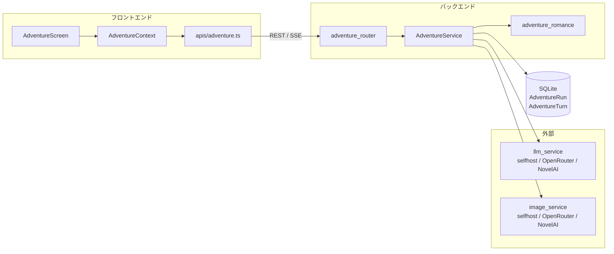
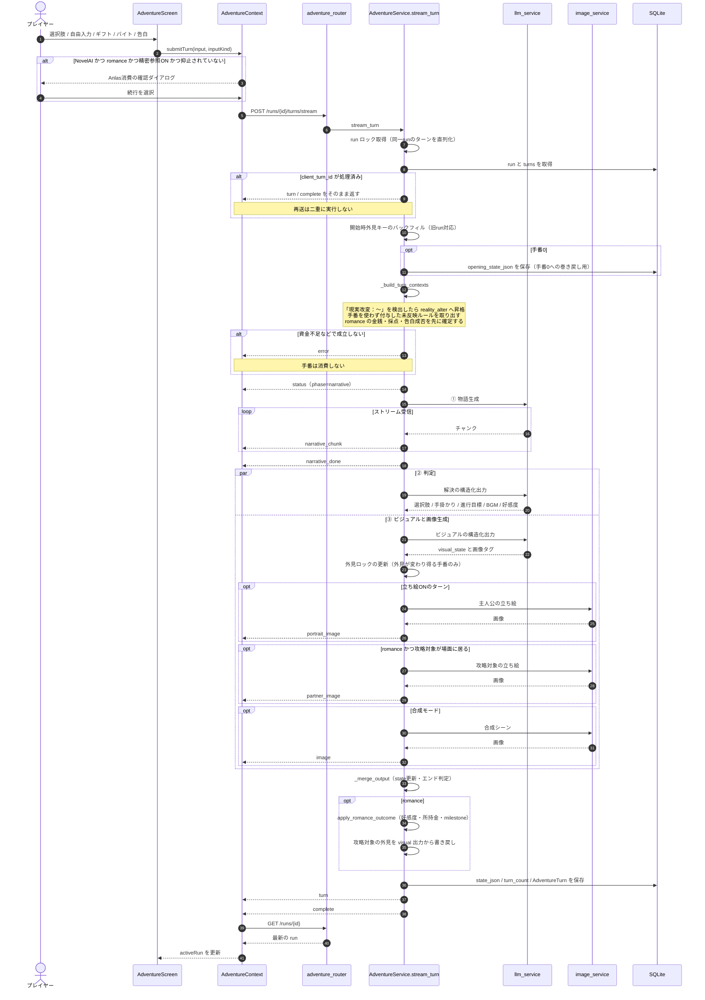
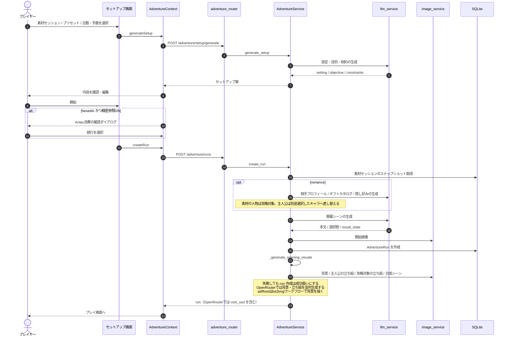
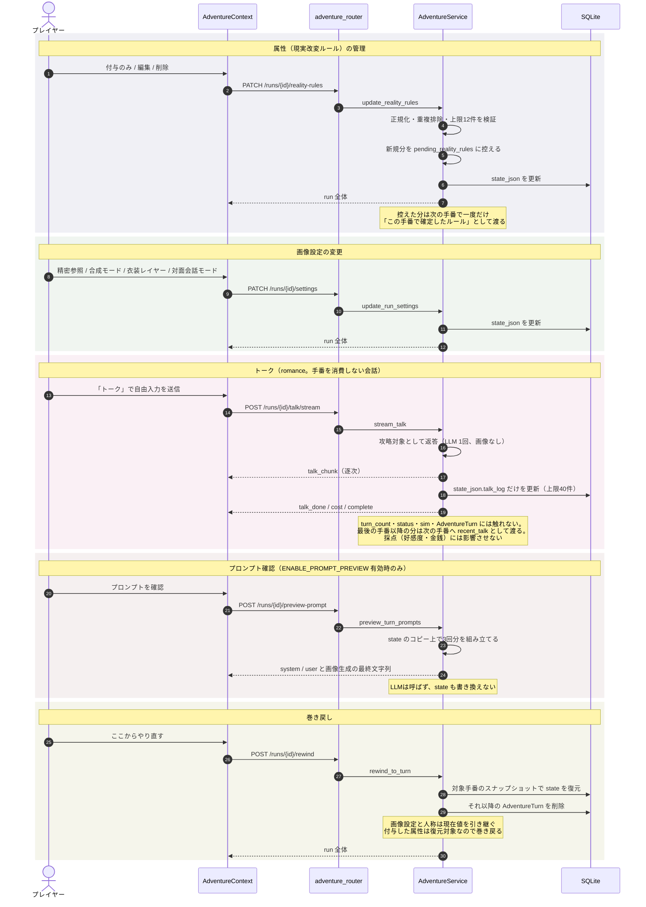
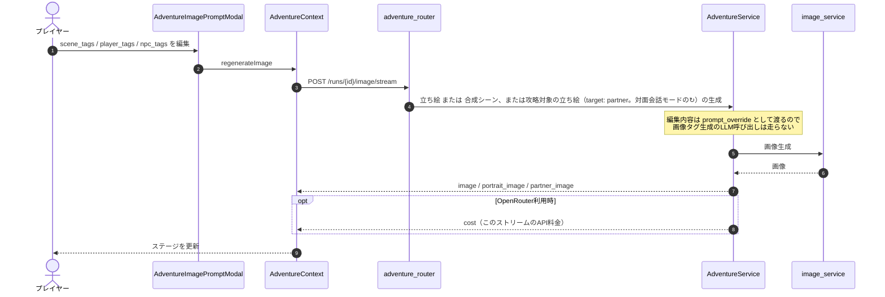

# アドベンチャーモードの処理の流れ

Adventure（ミッション系プリセットと恋愛シミュレーション）の処理をシーケンス図でまとめる。
VS Code の Markdown プレビュー、または GitHub 上でそのまま Mermaid として表示できる。

対象コード:

- バックエンド: `backend/gateway/routes/adventure_router.py`、`backend/gateway/services/adventure_service.py`、`backend/gateway/services/adventure_romance.py`
- フロントエンド: `frontend/src/components/adventure/AdventureScreen.tsx`（入口。セットアップは `AdventureHub.tsx`、プレイは `AdventurePlay.tsx`）、`frontend/src/contexts/AdventureContext.tsx`、`frontend/src/apis/adventure.ts`

---

## 1. 全体像

Adventure は通常ゲームとは別の Context・API・サービス・DBモデル・SSE契約を持つ。

---

## 2. 1手番で何が送られるか

**1手番につき LLM を3回呼ぶ。** 画像タグだけを見ても入力側は分からないので、
付与した属性などを確認したいときは各回の user プロンプトを見る。

| 回  | 目的                       | システムプロンプト           | user プロンプト                     |
| --- | -------------------------- | ---------------------------- | ----------------------------------- |
| ①   | 物語本文（ストリーム）     | `_narrative_system_prompt`   | `turn_context` の JSON              |
| ②   | 判定（選択肢・BGM・好感度）| `_resolution_system_prompt`  | `turn_context` の JSON（①と同じ）   |
| ③   | ビジュアル（画像タグ）     | `_visual_system_prompt`      | `_visual_user_payload`（本文を含む）|

`turn_context` には `reality_rules`（付与した属性）、`state`、`sim`、
`required_visual_appearance` などが入る。持ち物システムが ON の run では
`inventory`（所持品と直近ログ）、`npc_states`（境界侵害の記録）、パネル操作なら
`item_action` / `item_resolution` も入り、②の判定出力に `world_events`（物語が実際に
示した受け渡し・使用・着脱・境界侵害）と、現実改変ターンだけ `reality_patch`
（所持品・NPC 記憶の直接書き換え）が加わる。Python 側が所持・数量・能力を検証して
適用するため、プレイヤーの発言だけでは持ち物は増えない。`ENABLE_PROMPT_PREVIEW=true` なら
画像設定ポップオーバーの「プロンプトを確認」から実際の送信文字列を確認できる。

---

## 3. ターン処理（中心的な流れ）

### 補足

- **プロバイダーは通常ゲームと同じ設定に従う**。テキストは `FEELING_PROVIDER`、
  画像は `IMAGE_PROVIDER`（selfhost / openrouter / novelai）。NovelAI固有機能は
  次のように劣化する: 非NovelAIではキャラクター枠・negative prompt・seed が
  使えず1本のプロンプトへ畳む（`_flatten_scene_prompt`）。参照画像は追加費用
  なしで常に使う（精密参照トグルはNovelAI専用）。selfhost（ComfyUI）は
  背景を txt2img 用ワークフロー（`COMFYUI_TXT2IMG_WORKFLOW_PATH`、既定は編集用
  テンプレート名の `image_edit` を `image_txt2img` に置き換えたもの）で生成し、
  立ち絵・合成は既存画像の編集で賄う。
- **並列なのは②と③だけ**で、①の本文が確定してから走る。③は本文を入力に取るため。
- **画像は③の中で直列**に生成する（背景 → 主人公の立ち絵 → 攻略対象の立ち絵 →
  合成シーン）。立ち絵と合成で同じシードを使い、衣装の描画差を抑える。
  **対面会話モード**（romance の `state_json["companion_mode"]`）では
  1手番＝1往復の会話になる（半日枠・昼夜・時間経過は無く、判定結果の
  day/slot は LLM に見せない。尺は日数でなくターン数）。本文は3ビート
  「相手の反応の地の文1行 → 攻略対象のセリフ1〜2行 → 相手側からの展開（問い返し・
  行動・話題の一歩）」で全体2〜5文を台本形式（`名前「セリフ」` の独立行）で
  書かせ、FE が話者ラベル表示と読み上げ対象の抽出に使う。拒絶・沈黙など短さが
  答えになる場面は短いままにする。画像は主人公の
  立ち絵と合成シーンを設定に関わらず省き、背景（現在地が変わったときだけ。
  キーは時間帯を含まない現在地のみで、昼夜タグも落として生成する）と
  攻略対象の立ち絵だけを描く。攻略対象の立ち絵を描かなかった手番（場面が
  前手番と同じ・相手が場面に居ない・毎ターン描く OFF・生成失敗・場面判定失敗）は
  理由を `state_json["partner_portrait_status"]` に記録して `turn` / run に載せ、
  FE がメッセージ窓のメタ行とターン詳細に「立ち絵は前の手番のまま（理由）」を出す。
  **OpenRouter のときだけ**、従量課金APIで同時リクエストが可能なため
  背景・主人公・攻略対象を `asyncio.gather` で並列生成する（合成のみ後段）。
  `model_execution_gate` も OpenRouter は直列化しない。並列時の state 保存は
  `_persist_locks` で read-modify-write を直列化する。
- **API料金（OpenRouter）**はターン内の全呼び出しを `_CostTracker`
  （ContextVar）で集計し、`complete` 直前に `cost` イベントで配信する。
  REST応答（run作成・セットアップ生成・選択肢再生成・画像再生成）は
  `cost_usd` フィールドで返す。FEは `SettingsContext.totalCost` へ累算し、
  HUDのメトリクス行に累計を表示する。
- **攻略対象の外見の書き戻しは `apply_romance_outcome` より後**に行う。
  判定側は visual を見ない別呼び出しで、入れ替わり宣言でも元の外見をそのまま
  返してくることがあり、先に書くと上書きされて次の手番で姿が戻る。
- SSE イベントは `status` / `narrative_chunk` / `narrative_done` / `portrait_image` /
  `partner_image` / `background_image` / `image` / `cost` / `turn` / `complete` /
  `error`。通常ゲームの `useSSE` には流さず、`apis/adventure.ts` の専用パーサで
  処理する。トーク（5. 参照）は同じパーサで `talk_chunk` / `talk_done` を扱う。
- **3D モデル表示中の FE** は `narrative_done` の時点で攻略対象のセリフの読み上げを
  始め（②の判定と保存を待たない）、ステージの進捗オーバーレイを出さずに判定中の
  進捗を行動パネルに出す。表情・身振りは `turn` で届くので、その時点で切り替える。

---

## 4. Run の作成

---

## 5. 手番を消費しない操作

進行を進めずに state だけを変える操作。いずれも `stream_turn` と同じ run ロックを
取るので、ターン処理中は完了を待ってから実行される。

---

## 6. 画像の再生成

場面画像のタグを手で直して描き直す経路。手番は進まない。

> このモーダルが扱うのは最終段の画像タグだけで、付与した属性などの入力側は
> すでにタグへ蒸留されている。入力側を見たい場合は「5. 手番を消費しない操作」の
> プロンプト確認を使う。
